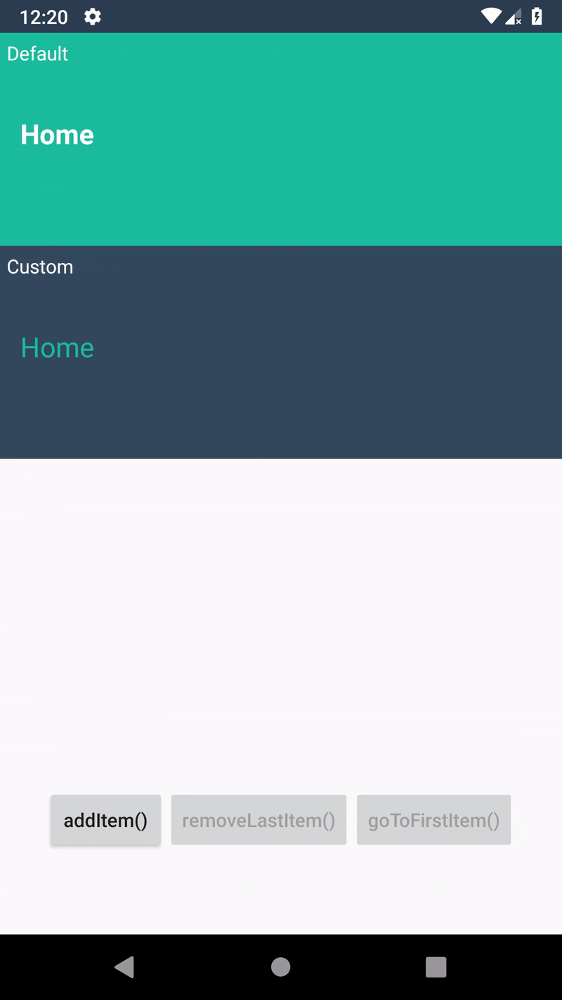

[](https://jitpack.io/#adrielcafe/KrumbsView) 
[](https://android-arsenal.com/api?level=14)
[](https://opensource.org/licenses/MIT)

# KrumbsView
The ultimate breadcrumbs view for Android!

Inspired by [JotterPad](https://play.google.com/store/apps/details?id=com.jotterpad.x)'s breadcrumbs.



Features:

- [X] Customisable text colors and separator icon
- [X] Cool animations
- [X] Swipe right to go back to the previous item
- [X] Survive Activity recreations
- [X] Extensible (open classes and protected members, extend it to get the job done!)
- [ ] Custom typeface (Soon™)

## How to use

### Import to your project

First, add it in your root build.gradle at the end of repositories:

```gradle
allprojects {
    repositories {
        ..
        maven { url 'https://jitpack.io' }
    }
}
```

Next, add the dependency to your app modules:

```gradle
dependencies {
    compile 'com.github.adrielcafe:krumbsview:$latestVersion'
}
```

### XML
```xml
<cafe.adriel.krumbsview.KrumbsView
    android:id="@+id/krumbsView"
    android:layout_width="match_parent"
    android:layout_height="wrap_content"
    android:background="@color/colorPrimary"
    app:krumbsStartItem="[string]"
    app:krumbsBoldText="[true|false]"
    app:krumbsCurrentItemTextColor="[color]"
    app:krumbsPreviousItemTextColor="[color]"
    app:krumbsSeparatorTintColor="[color]"
    app:krumbsSeparatorIcon="[drawable]"
    app:krumbsAnimationType="[slideLeftRight|fadeInOut|growShrink]"
    app:krumbsAnimationDuration="[shortDuration|longDuration]"/>
```

### Kotlin/Java
```kotlin
with(krumbsView){
    size
    getItems()
    getCurrentItem()
    addItem(Krumb("Lorem Ipsum"))
    removeLastItem()
    removeAllItems()
    goToFirstItem()
    setOnPreviousItemClickListener { /* ... */ }
    
    // All XML options are available
    setBoldText(true)
    setCurrentItemTextColor(Color.WHITE)
    setPreviousItemTextColor(color(R.color.transparent_white))
    setSeparatorTintColor(color(R.color.transparent_white))
    setSeparatorIcon(R.drawable.ic_keyboard_arrow_right)
    setAnimationType(KrumbsAnimationType.GROW_SHRINK)
    setAnimationDuration(KrumbsAnimationDuration.SHORT)
}
```

You can also use your custom Krumb implementation:
```kotlin
data class MyKrumb(val id: Int, 
                   val folderName: String, 
                   val createdAt: Date) : Krumb(folderName)

with(krumbsView){
    addItem(MyKrumb(123, "Folder XYZ", now))

    val myKrumb = getCurrentItem() as MyKrumb
}
```
